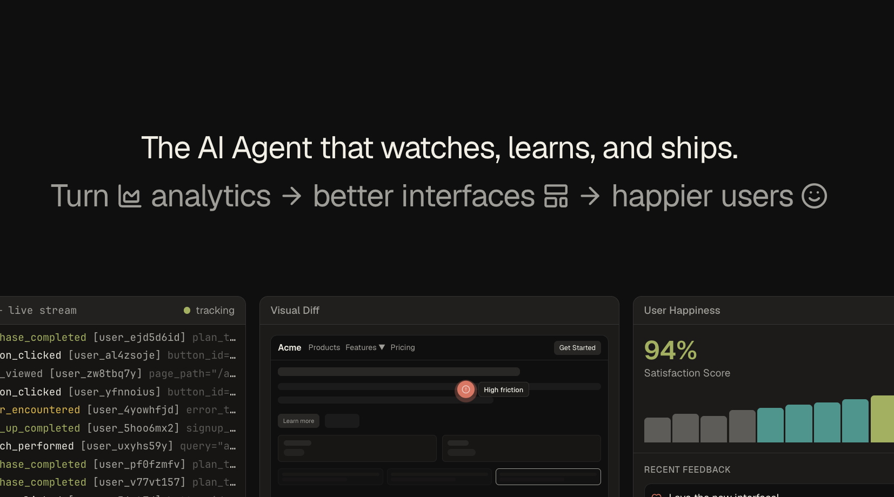

# Frictionless



**An AI agent that watches how users actually behave—and fixes what's broken before they leave.**

---

## The Problem

Users don't file bug reports when your interface frustrates them. They just leave. Traditional analytics tell you *what* happened (67% dropped off at step 3) but never *why*—and certainly not *what to do about it*.

Real UX research costs $10K+ and takes weeks. By the time you have insights, you've lost thousands of users.

## The Solution

Frictionless creates a continuous self-improving loop:

```
Behavioral Events → AI Pattern Detection → Generated UI Fixes → A/B Testing → Deploy Winners
```

1. **Capture behavioral signals**: Rage clicks, hover hesitation, form abandonment, scroll patterns
2. **Detect friction patterns**: AI surfaces insights no human would catch
3. **Generate code fixes**: Not just reports—actual component changes
4. **Validate with A/B tests**: Statistical significance before deployment
5. **Auto-deploy winners**: The product improves itself

## Architecture

```
┌─────────────────┐    ┌──────────────────┐    ┌─────────────────┐
│  Your Product   │───▶│   Event Stream   │───▶│   AI Analysis   │
│                 │    │   (rrweb + SDK)  │    │                 │
└─────────────────┘    └──────────────────┘    └─────────────────┘
                                                        │
┌─────────────────┐    ┌──────────────────┐            ▼
│   Dashboard     │◀───│   Session Replay │◀───┌─────────────────┐
│                 │    │                  │    │  Code Generator │
└─────────────────┘    └──────────────────┘    └─────────────────┘
```

## Stack

| Layer | Technology |
|-------|------------|
| Monorepo | Turborepo, pnpm |
| Frontend | React 19, React Router v7, Tailwind v4 |
| Session Recording | rrweb |
| Analytics | Amplitude SDK |
| Experiments | Amplitude Experiment |
| Animations | Framer Motion |

## Event Schema

```typescript
// Friction signals
rage_click_detected    { element, click_count, frustration_score }
hover_hesitation       { element, duration_ms, did_interact }
form_field_abandoned   { field_name, time_spent, error_shown }

// Conversion funnel
checkout_started       { plan_type, friction_points_encountered }
purchase_completed     { revenue, time_to_convert }
```

## Behavioral Personas

Frictionless clusters users by how they behave, not who they are:

| Persona | Signals | Adaptation |
|---------|---------|------------|
| Power User | Keyboard shortcuts, bulk actions, fast decisions | Compact UI, advanced features |
| Explorer | Help searches, slow deliberation, tooltip hovers | Guided flows, progressive disclosure |
| At-Risk | Rage clicks, support hovers, session drops | Simplified UI, proactive help |

## Development

```bash
pnpm install
pnpm dev
```

## Team

Built at UofTHacks 13 for the Amplitude Technical Challenge.

---

*Products should learn from their failures faster than users experience them.*
